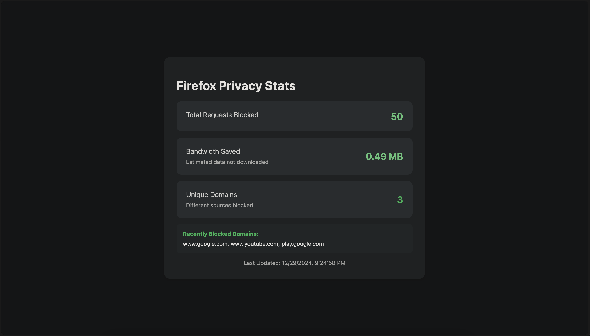

# **Firefox Privacy Stats Dashboard**

A custom Firefox new tab page that displays real-time privacy statistics collected from uBlock Origin. This project uses a Python Flask server to track and serve data, and a lightweight HTML dashboard to visualize the stats. It demonstrates skills in web development, browser extensions, and backend APIs.

## **Features**
- Displays the total number of requests blocked by uBlock Origin.
- Shows bandwidth saved (in MB) by blocking unwanted requests.
- Tracks the number of unique domains blocked.
- Provides a breakdown of request types blocked (e.g., ads, trackers, etc.).
- Lists recently blocked domains.
- Real-time updates every 5 seconds using a Python Flask server.

## **Technologies Used**
- **Python**: Backend server using Flask for API endpoints and static file hosting.
- **HTML, CSS, JavaScript**: Frontend for the new tab page.
- **Browser Extension**: Firefox extension to capture uBlock Origin's blocking activity.
- **JSON**: Data storage for stats persistence.

---

## **Setup Instructions**

### **1. Clone the Repository**
```bash
git clone https://github.com/shahshlok/firefox-privacy-stats.git
cd firefox-privacy-stats
```

### **2. Install Dependencies**
Make sure you have Python 3 installed. Then, install Flask and Flask-CORS:
```bash
pip install flask flask-cors
```

### **3. Project Structure**
```plaintext
firefox-privacy-stats/
├── server.py               # Python Flask server
├── ublock_stats.json       # JSON file to store stats
├── static/
│   └── index.html          # New tab page (HTML, CSS, JS)
├── extension/
│   ├── manifest.json       # Firefox extension manifest
│   └── background.js       # Extension background script
```

### **4. Run the Server**
Start the Python server:
```bash
python3 server.py
```
The server will run on `http://127.0.0.1:5000/`.

### **5. Configure Firefox New Tab Override**
1. Install the [New Tab Override](https://addons.mozilla.org/en-US/firefox/addon/new-tab-override/) extension in Firefox.
2. Open its settings and select "Custom URL."
3. Enter `http://127.0.0.1:5000/` as the custom URL.

### **6. Load the Firefox Extension**
1. Open `about:debugging` in Firefox.
2. Click "This Firefox" on the left sidebar.
3. Click "Load Temporary Add-on."
4. Select the `manifest.json` file from the `extension/` directory.

---

## **How It Works**

1. The Firefox extension listens for blocked requests using uBlock Origin's blocking events (`webRequest.onErrorOccurred`).
2. For each blocked request:
   - The extension sends data (e.g., URL, request type) to the Python server via a POST request to `/update`.
3. The Python server:
   - Updates the stats in `ublock_stats.json`.
   - Serves the new tab page (`index.html`) via Flask's static file hosting.
4. The new tab page:
   - Fetches stats from the `/stats` endpoint every 5 seconds.
   - Displays updated stats in a visually appealing dashboard.

---

## **Features in Detail**

### **Dashboard Features**
The new tab page (`index.html`) displays:
- **Total Requests Blocked**: The cumulative number of requests blocked by uBlock Origin.
- **Bandwidth Saved**: The total bandwidth saved by blocking unwanted requests (in MB).
- **Unique Domains Blocked**: The count of distinct domains blocked.
- **Recently Blocked Domains**: A list of domains that were recently blocked.
- **Request Types Blocked**: A breakdown of different types of requests (e.g., ads, trackers).

### **API Endpoints**
The Flask server provides two main endpoints:
1. `GET /stats`: Returns current stats in JSON format.
2. `POST /update`: Updates stats with data sent by the browser extension.

---

## Screenshots



---

## **Future Improvements**
- Add support for more granular tracking (e.g., specific ad networks).
- Improve UI/UX with animations and better responsiveness.
- Package the browser extension for permanent installation in Firefox.

---

## **Contributing**
Contributions are welcome! Feel free to open issues or submit pull requests.

---

## **License**
This project is licensed under the MIT License.

---

Feel free to modify this README to fit your preferences or add specific details about your implementation (e.g., screenshots). Once you're ready, push it to GitHub:

```bash
git init
git add .
git commit -m "Initial commit"
git branch -M main
git remote add origin https://github.com/yourusername/firefox-privacy-stats.git
git push -u origin main
```

Let me know if you need help with anything else!